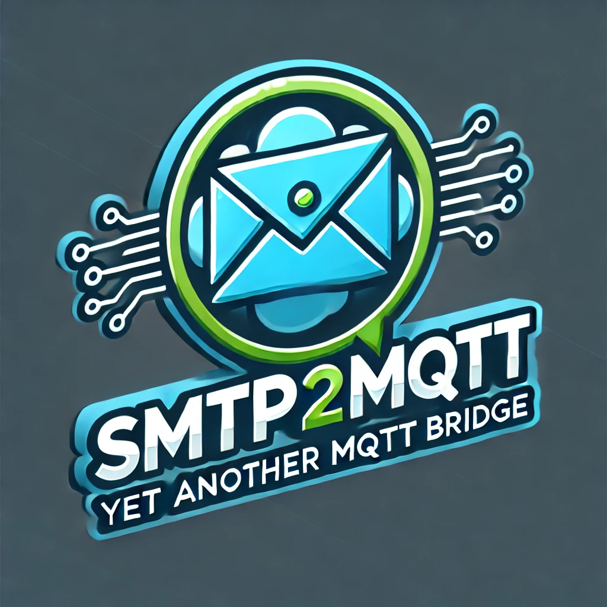

# Home Assistant Add-on: SMTP 2 MQTT add-on

Serve a local SMTP server where your IoT devices can connect to and send emails with. The SMTP Server will intercept the sent SMTP Messages and transfers them to MQTT messages which are published by your MQTT broker for further use.

![Supports aarch64 Architecture][aarch64-shield]
![Supports amd64 Architecture][amd64-shield]
![Supports armhf Architecture][armhf-shield]
![Supports armv7 Architecture][armv7-shield]
![Supports i386 Architecture][i386-shield]

[aarch64-shield]: https://img.shields.io/badge/aarch64-yes-green.svg
[amd64-shield]: https://img.shields.io/badge/amd64-yes-green.svg
[armhf-shield]: https://img.shields.io/badge/armhf-yes-green.svg
[armv7-shield]: https://img.shields.io/badge/armv7-yes-green.svg
[i386-shield]: https://img.shields.io/badge/i386-yes-green.svg

Images and Logos made with love using [ChatGPT](https://openai.com/)